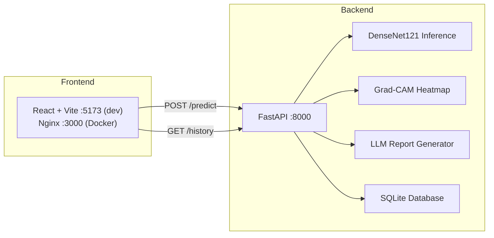

# 🫁 Medical AI Platform

> Advanced AI-powered chest X-ray classification with Grad-CAM explainability and LLM-generated medical reports.

---

## Architecture



## Features

| Feature | Description |
|---|---|
| **X-Ray Classification** | DenseNet121 model fine-tuned for NORMAL vs. PNEUMONIA detection |
| **Grad-CAM Heatmaps** | Visual explanation of model attention regions |
| **AI Medical Reports** | xAI Grok LLM-generated reports with automatic fallback to templates |
| **Prediction History** | Full audit trail stored in SQLite with clickable detail modal |
| **REST API** | FastAPI with auto-generated OpenAPI docs at `/docs` |
| **React Frontend** | Premium dark-mode SPA with drag-and-drop upload, confidence bars, heatmap viewer |
| **Docker Ready** | One-command deployment with `docker-compose up` |

---

## Quick Start

### Prerequisites

- Python 3.11+ and Node.js 18+
- Your trained `model.pt` placed in `models/` directory

### Local Development

```bash
# 1. Create & activate Python virtual environment
python -m venv venv
venv\Scripts\activate        # Windows
# source venv/bin/activate   # macOS/Linux

# 2. Install Python dependencies
pip install -r requirements.txt

# 3. (Optional) Generate test model if you don't have model.pt yet
python tests/create_test_model.py

# 4. (Optional) Set xAI API key for LLM reports
set XAI_API_KEY=xai-your-key-here      # Windows
# export XAI_API_KEY=xai-your-key      # macOS/Linux

# 5. Start the FastAPI backend
uvicorn app.api.main:app --reload --port 8000

# --- In a new terminal ---

# 6. Install frontend dependencies
cd frontend
npm install

# 7. Start the React dev server
npm run dev
```

- **API Docs**: http://localhost:8000/docs
- **React Frontend**: http://localhost:5173

### Docker (Both Services)

```bash
# Build and run both backend + frontend
docker-compose up --build

# Or detached
docker-compose up --build -d
```

- **API**: http://localhost:8000
- **React Frontend**: http://localhost:3000

---

## Frontend Overview

The React SPA (`frontend/`) is built with **Vite + vanilla CSS** and has:

| Component | Description |
|---|---|
| `App.jsx` | Root — tab state + API health polling every 15s |
| `Header.jsx` | Brand + live backend connection indicator |
| `HeroBanner.jsx` | Gradient hero section |
| `TabNav.jsx` | Tab switcher (Prediction / History) |
| `PredictTab.jsx` | Drag-and-drop upload, analyze button, results |
| `HistoryTab.jsx` | Metric cards + sortable table with click-to-expand |
| `DetailModal.jsx` | Full prediction detail popup (heatmap + report) |
| `api.js` | All API calls, configurable via `VITE_API_BASE_URL` |

---

## API Endpoints

| Method | Endpoint | Description |
|---|---|---|
| `GET` | `/health` | Service healthcheck |
| `POST` | `/predict` | Upload image → full analysis pipeline |
| `GET` | `/history` | List all past predictions |
| `GET` | `/history/{id}` | Full details for one prediction |
| `GET` | `/reports/{filename}` | Serve heatmap PNG file |

### Example: POST /predict

```bash
curl -X POST "http://localhost:8000/predict" \
  -F "file=@chest_xray.png"
```

Response:
```json
{
  "id": 1,
  "image_filename": "chest_xray.png",
  "predicted_class": "PNEUMONIA",
  "confidence": 0.9423,
  "report_text": "## Chest X-Ray Analysis Report ...",
  "heatmap_path": "reports/gradcam_abc12345.png",
  "created_at": "2026-07-24T14:30:00"
}
```

---

## Environment Variables

| Variable | Default | Description |
|---|---|---|
| `XAI_API_KEY` | *(empty)* | xAI Grok API key; if unset, template reports are generated |
| `GROK_MODEL` | `grok-3-mini` | xAI Grok model for LLM report generation |
| `API_HOST` | `0.0.0.0` | FastAPI listen host |
| `API_PORT` | `8000` | FastAPI listen port |
| `VITE_API_BASE_URL` | *(empty)* | React frontend API base URL (empty = use Vite proxy) |

---

## Project Structure

```
medical-ai-platform/
├── app/
│   ├── api/
│   │   ├── main.py          # FastAPI app & routes
│   │   └── schemas.py       # Pydantic request/response models
│   ├── core/
│   │   └── config.py        # Paths, constants, env vars
│   ├── db/
│   │   ├── models.py        # SQLAlchemy ORM models
│   │   └── session.py       # DB engine & session setup
│   ├── llm/
│   │   └── report.py        # LLM report generator (with mock fallback)
│   └── ml/
│       ├── inference.py     # Model loading & prediction
│       └── gradcam.py       # Grad-CAM heatmap generation
├── frontend/                 # React + Vite SPA
│   ├── src/
│   │   ├── components/
│   │   │   ├── Header.jsx
│   │   │   ├── HeroBanner.jsx
│   │   │   ├── TabNav.jsx
│   │   │   ├── PredictTab.jsx
│   │   │   ├── HistoryTab.jsx
│   │   │   └── DetailModal.jsx
│   │   ├── api.js           # API service module
│   │   ├── App.jsx          # Root component
│   │   ├── main.jsx         # Entry point
│   │   └── index.css        # Design system (dark mode)
│   ├── index.html
│   ├── vite.config.js
│   └── package.json
├── models/
│   └── model.pt             # Trained DenseNet121 checkpoint
├── reports/                  # Generated heatmaps
├── tests/
│   ├── create_test_model.py
│   ├── test_inference.py
│   └── test_api.py
├── nginx.conf               # Nginx config for Docker
├── Dockerfile               # Multi-stage: backend + frontend
├── docker-compose.yml
├── requirements.txt
├── .env.example
└── README.md
```

---

## Testing

```bash
# Generate test model (if models/model.pt doesn't exist)
python tests/create_test_model.py

# Run all tests
python -m pytest tests/ -v
```

---

## Disclaimer

This is an AI-powered tool for **educational purposes only** and is not intended as a medical diagnostic tool. Always consult a licensed physician for health concerns.
